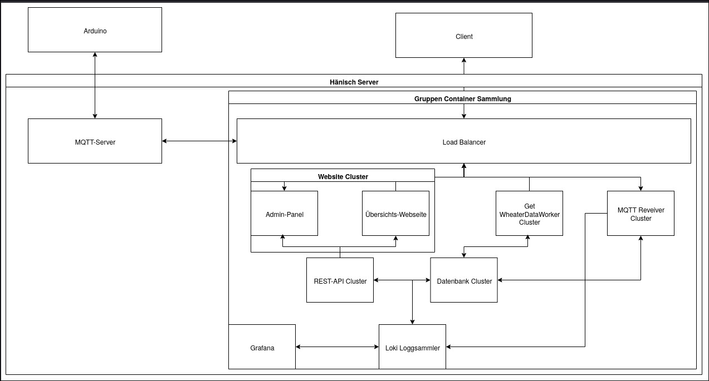

# Architecture Constraints and Solution Strategy {#section-architecture-constraints-and-solution-strategy}

## Architecture Contraints

| Category         | Constraint                                                                                   |
|------------------|---------------------------------------------------------------------------------------------|
| **Technical**    | The project will be hosted on a single server provided by Prof. Hänisch                      |
| **Technical**    | Indoor temperature measurement hardware is supplied by the university                        |
| **Technical**    | At least two data sources are required, with at least one being an Arduino device            |
| **Technical**    | The hardware and database are not specifically designed for high reliability                 |
| **Technical**    | The final system must run in a clean environment with no prior setup required                |
| **Organizational** | Weekly meetings with a coach are scheduled for project discussions                         |
| **Political**    | The submission deadline is the 04.09.2025

---

## System Decomposition Strategy

All services are containerized and grouped under a shared container orchestration layer (labelled "Gruppen Container Sammlung"). The system is fronted by a load balancer, ensuring scalability and high availability. MQTT acts as the bridge between the hardware (Arduino sensors) and the backend. Logging and observability are handled via the Loki stack, and external visibility is offered via a user-facing website and Grafana deshboards.

> [!info]- Old Architecture
>

---

## Organizational / Development Process Decisions

- **Source Control**: GitHub with structured branches and CI pipelines
- **Documentation**: Based on **arc42 template**, managed in MkDocs
- **Infrastructure as Code:** All services defined in `docker-compose.yml` and version-controlled  
- **Architecture Decisions**: Documented using ADRs (Architecture Decision Records). The detailed technology choices are documented in [04 Architecture Decisions](04_architecture_decisions.md)

---

## Cross-cutting Concepts

The following concepts ensure consistency and support the quality goals:

### Domain Concepts
- **ΔT metric:** Temperature difference between indoor and outdoor sensors as key indicator.  
- **Sensor units:** Each Arduino node has a unique ID and physical placement (e.g., north vs. south façade).  
- **Enriched records:** Each reading contains value, timestamp, and source ID.  

### Fault Tolerance
- **Redundant logging:** Default to central database, with SD card fallback on network/MQTT outages (buffering up to 24h).  
- **MQTT QoS (1):** Guarantees at-least-once delivery.  
- **Stateless services:** Enable fast restart and failover without data inconsistencies.  

### Architecture and Design Patterns
- **Message-driven architecture:** Asynchronous data flow via MQTT.  
- **Microservices:** Independent services for ingestion, enrichment, API.  
- **API gateway pattern:** REST API shields internal complexity and exposes a single entry point.  

### Development Concepts
- **Containerization:** Consistent deployment via Docker.  
- **Continuous Integration:** Automated checks and tests before merges.  
- **Infrastructure as Code:** Networks and dependencies tracked in source control.  

### Operational Concepts
- **Observability:** Logs via Loki, metrics via Prometheus, dashboards via Grafana.  
- **Health monitoring:** `/health` endpoints with automated restart on failure.  
- **Scalability:** Additional instances (frontend, MQTT receivers, workers) can be added behind Traefik.