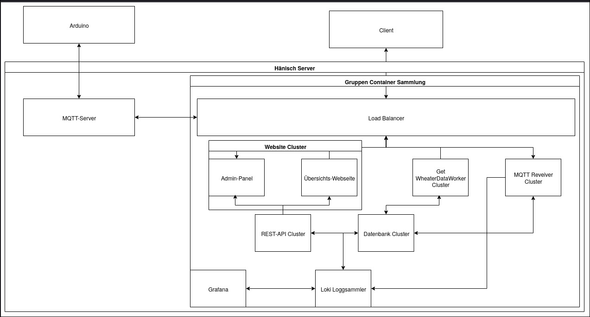

# Context and Scope {#section-context-and-scope}

## Technical Context {#_technical_context}

The IsoPrüfi system operates in a distributed container-based architecture hosted on the DHBW Server infrastructure. It integrates multiple services for data ingestion, processing, storage, and visualization.

### Components and Channels

| Component                       | Communication Channel       | Description                                                                 |
|----------------------------------|------------------------------|-----------------------------------------------------------------------------|
| **Arduino**                     | Wi-Fi to MQTT Broker | Publishes temperature readings to defined MQTT topics                      |
| **MQTT Server**                 | MQTT over TCP/IP            | Central broker for sensor communication                                    |
| **MQTT Receiver Cluster**       | MQTT (Subscriber)           | Listens to relevant topics and processes incoming sensor data              |
| **WeatherDataWorker Cluster**   | HTTP API                    | Pulls external weather data via scheduled API calls                        |
| **REST API Cluster**            | HTTP (internal/external)    | Provides unified access to system data (e.g., for frontend)                |
| **Database**            | SQL/TCP                     | Stores processed and raw data for persistence                              |
| **Website Cluster**             | HTTP                        | Offers web-based interfaces (overview page, admin panel)                   |
| **Load Balancer**               | Reverse Proxy (HTTP)        | Distributes requests across Website and API clusters                       |
| **Grafana**                     | HTTP                        | Provides visualization of log data                  |
| **Loki Log Collector**          | Log Pipeline (gRPC/HTTP)    | Collects and forwards logs from all clusters for analysis                  |
| **Client**                      | Browser over HTTPS          | Interacts with the web interface                                           |

---

### Mapping I/O to Channels

| I/O Type                 | Channel                 | Source              | Destination          |
|--------------------------|--------------------------|----------------------|-----------------------|
| Temperature Reading      | MQTT                    | Arduino              | MQTT Receiver Cluster |
| Weather Data Pull        | HTTP API                | Weather API          | WeatherDataWorker     |
| Web Page Access          | HTTPS                   | Client Browser       | Website Cluster       |
| Sensor Dashboard Update  | REST                    | Website Cluster      | REST API → DB         |
| System Logs              | Internal Log Stream     | All services         | Loki / Grafana        |

---

### Explanation

All services are containerized and grouped under a shared container orchestration layer (labelled "Gruppen Container Sammlung"). The system is fronted by a load balancer, ensuring scalability and high availability. MQTT acts as the bridge between the hardware (Arduino sensors) and the backend. Logging and observability are handled via the Loki stack, and external visibility is offered via a user-facing website and optional Grafana panels.

> [!info]- Old Architecture
>

