# Context and Scope {#section-context-and-scope}

## Technical Context {#_technical_context}

The IsoPrüfi system operates in a distributed container-based architecture hosted on the DHBW Server infrastructure. It integrates multiple services for data ingestion, processing, storage, and visualization.

---

### Components and Channels

| Component              | Communication Channel | Description                                                |
|------------------------|-----------------------|------------------------------------------------------------|
| **Arduino**            | Wi-Fi / MQTT          | Publishes temperature readings to the MQTT broker          |
| **MQTT Broker**        | MQTT                  | External broker for sensor communication                   |
| **traefik**            | HTTP / HTTPS          | Reverse proxy and load balancer, entry point to the system |
| **isopruefi-backend**  | HTTP (REST)           | Provides unified access to system data                     |
| **isopruefi-frontend** | HTTPS                 | User interface for visualizing measurements                |
| **influxdb**           | TCP / SQL             | Time-series database for sensor data                       |
| **postgres**           | TCP / SQL             | Relational database for application data                   |
| **loki**               | gRPC / HTTP           | Collects and stores logs from all services                 |
| **prometheus**         | HTTP                  | Collects metrics from services                             |
| **grafana**            | HTTP                  | Dashboard for metrics and logs                             |
| **alloy**              | HTTP / gRPC           | Integrates Loki and Prometheus for observability           |
| **Weather API**        | HTTPS                 | Provides external weather data                             |
| **Client (Browser)**   | HTTPS                 | Interacts with the frontend                                |

For a detailed list of all Docker containers, their images, addresses and networks, see the separate documentation page: [Docker Development Environment](../docker-dev.md)

---

### Mapping I/O to Channels

| I/O Type            | Channel     | Source                 | Destination                                     |
|---------------------|-------------|------------------------|-------------------------------------------------|
| Temperature Reading | WiFi / MQTT | Arduino                | MQTT Broker → MQTT Receiver Worker              |
| Weather Data Pull   | HTTPS (API) | Weather API Service    | Weather Data Worker                             |
| Web Page Access     | HTTPS       | Client Browser         | Traefik → React Frontend                        |
| API Request         | HTTP / REST | Frontend (via Traefik) | REST API Service                                |
| Data Storage        | SQL / TCP   | Backend Services       | PostgreSQL (app data), InfluxDB (time series)   |
| System Logs         | gRPC / HTTP | All Services           | Alloy → Loki/Prometheus (visualized in Grafana) |

---

### Technical Context Diagram

